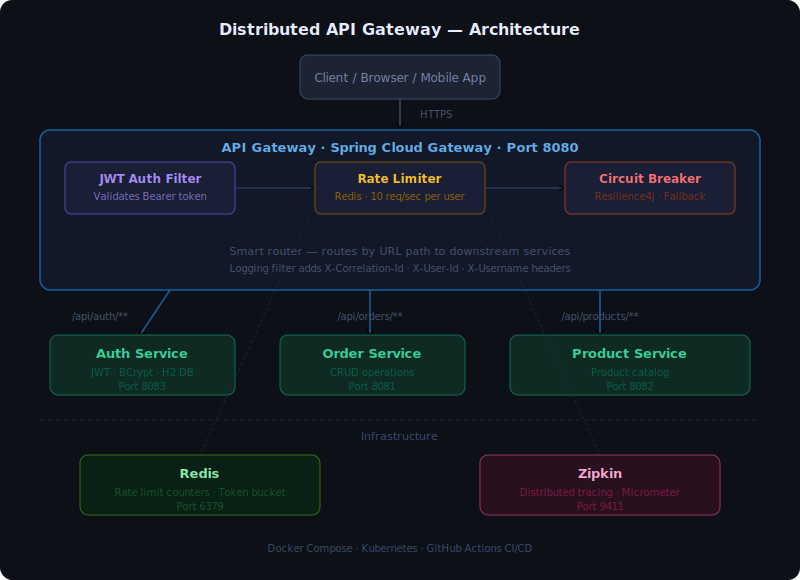

# Distributed API Gateway

A production-grade API Gateway built with Spring Boot, implementing JWT authentication, Redis rate limiting, circuit breaking, and distributed tracing.

## Architecture

- Client sends request to API Gateway port 8080
- Gateway checks JWT token, applies rate limiting, circuit breaker
- Routes to Auth Service 8083, Order Service 8081, Product Service 8082

## Features

- API Gateway and Routing via Spring Cloud Gateway
- JWT Authentication with JJWT 0.12.5
- Rate Limiting via Redis 10 requests per second per user
- Circuit Breaker via Resilience4j
- Distributed Tracing via Zipkin and Micrometer
- Docker and Docker Compose for containerization
- Kubernetes for orchestration
- GitHub Actions for CI/CD

## Tech Stack

- Java 17 and Spring Boot 3.2.5
- Spring Cloud Gateway WebFlux Reactive
- Redis for Rate limiting
- Resilience4j for Circuit breaker
- Zipkin for Distributed tracing
- H2 Database for Auth service dev
- Docker and Kubernetes

## Quick Start

Prerequisites: Java 17+, Docker Desktop, Maven 3.9+

Run with Docker Compose:
  docker-compose up --build

## Services and Ports

- API Gateway  : 8080
- Auth Service : 8083
- Order Service: 8081
- Product Service: 8082
- Redis        : 6379
- Zipkin UI    : 9411

## API Endpoints

Auth Public endpoints:
  POST /api/auth/register
  POST /api/auth/login
  POST /api/auth/refresh

Order endpoints JWT required:
  GET  /api/orders
  POST /api/orders
  GET  /api/orders/{id}

Product endpoints JWT required:
  GET /api/products
  GET /api/products/{id}
  GET /api/products/categories

## How JWT Auth Works

1. Client sends POST /api/auth/login and gets accessToken
2. Client sends request with Authorization Bearer token
3. Gateway validates JWT and extracts userId and username
4. Gateway adds X-User-Id and X-Username headers
5. Request forwarded to downstream service

## Rate Limiting

- 10 requests per second per user via Redis token bucket
- Exceeding limit returns 429 Too Many Requests

## Circuit Breaker States

- CLOSED normal state
- 50 percent failures triggers OPEN state with fallback response
- After 10 seconds moves to HALF-OPEN state
- Success in HALF-OPEN moves back to CLOSED

## Monitoring Endpoints

- Health Check   : http://localhost:8080/actuator/health
- Circuit Breakers: http://localhost:8080/actuator/circuitbreakers
- Gateway Routes : http://localhost:8080/actuator/gateway/routes
- Zipkin UI      : http://localhost:9411

## Kubernetes Deployment

  kubectl apply -f k8s/
  kubectl get pods
  kubectl get services

## Testing

Import postman-collection.json in Postman for complete API testing
1. Run Login User request - token is auto-saved
2. All protected endpoints use token automatically

## Project Structure

distributed-api-gateway/
  gateway-service/    - Spring Cloud Gateway
  auth-service/       - JWT token management
  order-service/      - Order management
  product-service/    - Product catalog
  k8s/                - Kubernetes manifests
  .github/workflows/  - GitHub Actions CI/CD
  docker-compose.yml  - Local development
  postman-collection.json - API testing

## Author

Shekhar Suman
Java Backend Engineer - 4 years experience
Spring Boot, Microservices, Distributed Systems
